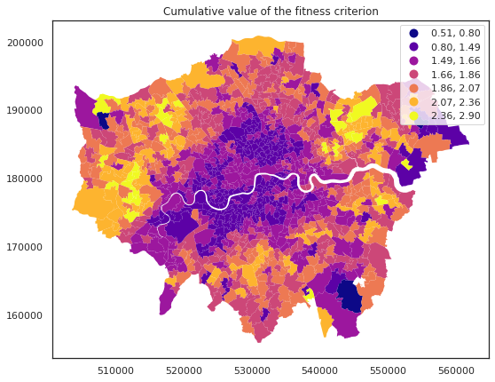
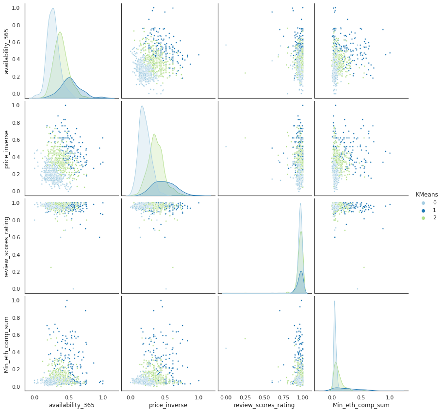
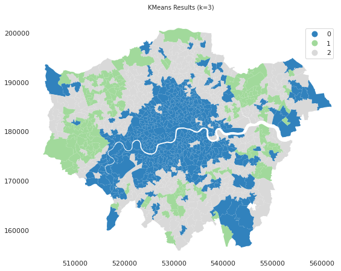

# CASA0013: Foundations of Spatial Data Science

## Opportunity for cultural tourism in London through Airbnb

### 21203853

### Word Count: 1514

# Executive Briefing

## Executive summary

The Airbnb platform was born in 2007 and was based on the concept of bed and breakfast within the informal setting of another person’s home. The platform has transformed radically since then, growing to a scale of 4 million hosts who have welcomed more than 1 billion guests in almost every country across the globe (‘About us’, .). With this significant growth there has been quite a shift from the “bed and breakfast” concept and this report, in some capacity, intends to address this problem and provide a proposal that is beneficial to all the stakeholders of Airbnb.

The report looks into the potential for developing a new cultural tourism service within the existing Airbnb platform. The cultural tourism service could be based on ethnic food, art, music and conversations that a host can provide for a guest. This service will enrich the guests’ experience, provide scope for additional income generation for the hosts, create an avenue for inclusivity and appreciation for different cultures, and ultimately lead to an increase in revenue for Airbnb.

For a prospective investor in the Airbnb platform, this report provides a brief insight into how to capitalise on London’s socio-cultural fabric. Airbnb’s business model has also been studied to understand how cultural tourism as a service can be beneficial for the host, guest and Airbnb, with an additional opportunity to build Airbnb’s brand image from a corporate social responsibility perspective.
The potential for such a service has been discussed through analysis of historic geocoded Airbnb data for London in combination with ethnicity-based data. The analysis looks into how areas with a low level of existing Airbnb rentals can be further encouraged by promoting the cultural experience that the host and neighbourhood can provide.

Lastly, the report discusses caveats and possible next steps for the implementation of the cultural tourism service within the Airbnb platform, locating key areas to pilot the initiative.

## Background

As per the 2011 census London is identified as the most ethnically diverse region in England and Wales where roughly 40.2% of the population identify as Asian, Black, Mixed or Other ethnic groups (Regional ethnic diversity, .). London also has the lowest proportion of White British people at 44.9%. These figures indicate that London is a very diverse and multi-cultural city with great market potential to tap into the cultural nuances that each ethnic group has to offer in the form of cuisine, music, art, etc.

Studies have shown that Airbnb hosts in all major cities have a significant overrepresentation of certain groups (e.g. young, White, female) as compared to the local population. There is also statistically significant evidence of gender and racial homophily. Inequalities that exist in a city along the lines of race are replicated in Airbnb transactions as well (Koh et al., 2019). Such biases could lead to reduced occupancy rates of Airbnb listing made by hosts from ethnic minority communities, contributing to a significantly large unexploited market and thus a revenue loss for Airbnb.

Looking closer at the business model Airbnb’s revenue is a combination of the following; a renting fee plus 6-12% percentage of the rental as service fee from the guest, and a 3% service fee from the host which is deducted from the rental (‘Airbnb Business Model’, .). Therefore, there are three main methods by which Airbnb can increase its revenue;
1.	Widen operations by increasing the number of hosts
2.	Increase occupancy in currently listed properties
3.	Increase value of each transaction and number of transactions 

Thus, a proposal for cultural tourism as an additional service that the host can provide could help ethnic minority communities in London attract more guests and earn a better income from their Airbnb listing. The cultural experience for example could be a cuisine taster secession for the guest to get to know the host’s ethnic cuisine and an opportunity to learn more about the culture.

The cultural tourism service would greatly help the ethnic minority communities by attracting more diverse hosts towards the Airbnb platform, increasing the occupation of currently listed properties owned by hosts from such communities and helping increase the value per transaction with the additional service that can be provided without much of an investment required by the host. All this could ultimately lead to an increase in revenue for Airbnb, which would be a key win from an investor’s perspective.

## Data Analysis

The data used in the following analysis includes July 2021 geocoded Airbnb data for London (Inside Airbnb. Adding data to the debate., .) and ethnicity data at MSOA level for London from the 2011 census (QS211EW (Ethnic group (detailed)) - Nomis - Official Labour Market Statistics, .).

This analysis aims to build on the research that low occupancy rates and low pricing of Airbnb listings are prevalent in areas with higher ethnic minority communities (Koh et al., 2019). The basic assumption made for the purposes of this analysis is that areas with a higher number of people from ethnic minority communities would have a higher percentage of hosts belonging to such communities. This assumption was made because the ethnicity of the host is not data provided as part of the Airbnb listing.

Through PCA (Principle Component Analysis), London’s MSOA (Middle Layer Super Output Areas) level data for the count of people belonging to 182 ethnic minority communities were reduced to 3 principle components for ease of analysis. Airbnb’s listing data was then aggregated at the London MSOA level (980 MSOAs) and combined with the ethnicity data.

A model was then developed to study the MSOAs in London which, from Airbnb’s perspective, could be areas with a high potential to improve listing occupancy rates through the use of cultural tourism service. Following are the fitness criterion for such MSOAs:
1.	A high number of people from ethnic minority communities
2.	Low median rental rate
3.	High availability of listings (low occupancy of listings)
4.	High median review score of listings

Based on a cumulative of all the fitness criterion, a heat map of all the London MSOAs was created (Fig.1). All fitness criterion have been normalised and are not weighted to avoid over-representation.

###### 
Fig.1 – Heatmap on London MSOAs based on cumulative of fitness criterion

The next step was to cluster MSOAs based on the cumulative value of the fitness criterion and check how each cluster performed in the different fitness criterion. Bench-marking the clusters could then facilitate the selection of MSOA’s with the greatest potential for transformation.

Through K-means clustering and evaluation of average silhouette scores, 3 clusters of MSOAs were generated and their distribution was checked against the fitness criterion (Fig.2). From the distribution plots it becomes evident that Cluster 1, despite having a low number of MSOAs, has the following characteristics:
1.	Higher median value for listing availability
2.	Higher median value for inverse rental rate (Low median rental rate)
3.	High median value for review score of listings
4.	Higher median value for people from ethnic minority communities

    

###### 
Fig.2 – K-Means cluster distribution for fitness criterion

Plotting the 3 generated MSOA clusters on a map (Fig.3), it becomes evident that the optimum Cluster 1 MSOAs are located away from central London. This could indicate the fact that ethnic minority communities are predominantly located away from central London, where listing prices and occupancy are relatively lower compared to central London. Thus, there is a necessity for alternative services or experiences like cultural tourism to attract guests to areas outside of central London. 

###### 
Fig.3 – Clusters mapped by MSOA

## Conclusion
Gentrification and subsequent movement of ethnic minority population away from central London has been a key criticism that Airbnb has been facing (Shabrina, Arcaute and Batty, 2022). Thus the result from the analysis could be a combination of social biases that exist in the digital domain and location of ethnic minority communities, which has not been studied in this report. But, it is evident from the analysis that Airbnb could benefit from the introduction of cultural tourism in such areas leading to increased occupancy rates and prices for the listings in areas with a higher ethnic minority population. Such an initiative could also become part of Airbnb’s corporate social responsibility initiatives further building the brand’s image.

A major limitation in this study has been the lack of data regarding the host’s ethnicity and the assumption made for this using secondary data needs to be verified with primary data. The other issue is that availability of listings has been calculated in absolute terms. It would therefore be beneficial to calculate the availability as a percentage of the number of listings. Currently, MSOA’s with a lesser number of listings also show a low availability which is possibly not an accurate representation.

The ability for an additional service like cultural tourism to generate additional revenue while building Airbnb’s brand image could potentially be a great opportunity for investors. The study could be furthered using Genetic Algorithm based analysis of the data to add more complex fitness criterion and weights to each to achieve better insights into the areas where the introduction of the cultural tourism service would be successful and how to take it forward.

# Bibliography

‘About us’. (.). Airbnb Newsroom. Available at: https://news.airbnb.com/about-us/ (Accessed: 4 January 2022).

‘Airbnb Business Model’. (.). Business Model Toolbox. Available at: https://bmtoolbox.net/stories/airbnb/ (Accessed: 4 January 2022).

Inside Airbnb. Adding data to the debate. (.). Inside Airbnb. Available at: http://insideairbnb.com (Accessed: 4 January 2022).

Koh, V., Li, W., Livan, G. and Capra, L. (2019). ‘Offline biases in online platforms: a study of diversity and homophily in Airbnb’. EPJ Data Science, 8 (1), p. 11. [doi: 10.1140/epjds/s13688-019-0189-5.](https://epjdatascience.springeropen.com/articles/10.1140/epjds/s13688-019-0189-5)

QS211EW (Ethnic group (detailed)) - Nomis - Official Labour Market Statistics. (.). Available at: https://www.nomisweb.co.uk/census/2011/qs211ew (Accessed: 4 January 2022).

Regional ethnic diversity. (.). Available at: https://www.ethnicity-facts-figures.service.gov.uk/uk-population-by-ethnicity/national-and-regional-populations/regional-ethnic-diversity/latest (Accessed: 4 January 2022).

Shabrina, Z., Arcaute, E. and Batty, M. (2022). ‘Airbnb and its potential impact on the London housing market’. Urban Studies. SAGE Publications Ltd, 59 (1), pp. 197–221. [doi: 10.1177/0042098020970865](https://journals.sagepub.com/doi/full/10.1177/0042098020970865).

